# Architecture Overview - AIOps and GitOps for Cloud-Native Infrastructure

## System Architecture Diagram

```mermaid
graph TB
    %% User Layer
    User[👤 DevOps Engineer]
    Dashboard[📊 Kagent Dashboard<br/>Built-in Chat Interface]
    
    %% AI Layer
    Kagent[🤖 Kagent AI Agent]
    Ollama[🧠 Ollama LLM<br/>Local AI]
    
    %% MCP Layer
    MCP[🔧 MCP Server<br/>K8s + Git + Prometheus Tools]
    
    %% Infrastructure
    K8s[☸️ Kubernetes Cluster]
    
    %% Monitoring
    Prometheus[📊 Prometheus]
    Alerts[🚨 AlertManager]
    
    %% GitOps
    GitRepo[📚 Git Repository]
    ArgoCD[🔄 ArgoCD]
    PR[📋 Pull Requests<br/>Human Review]
    
    %% Connections
    User --> Dashboard
    Dashboard --> Kagent
    Kagent --> Ollama
    Kagent --> MCP
    MCP --> K8s
    MCP --> Prometheus
    MCP --> GitRepo
    K8s --> Prometheus
    Prometheus --> Alerts
    Alerts --> Kagent
    GitRepo --> ArgoCD
    ArgoCD --> K8s
    MCP --> PR
    PR --> GitRepo
    
    %% Styling
    classDef userLayer fill:#e3f2fd
    classDef aiLayer fill:#f3e5f5
    classDef mcpLayer fill:#e8f5e8
    classDef infraLayer fill:#fff3e0
    classDef monitorLayer fill:#fce4ec
    classDef gitopsLayer fill:#f1f8e9
    
    class User,Dashboard userLayer
    class Kagent,Ollama aiLayer
    class MCP mcpLayer
    class K8s infraLayer
    class Prometheus,Alerts monitorLayer
    class GitRepo,ArgoCD,PR gitopsLayer
```

## Use Case 1: Infrastructure Management

```mermaid
sequenceDiagram
    participant U as 👤 User
    participant D as 📊 Dashboard
    participant K as 🤖 Kagent
    participant M as 🔧 MCP Server
    participant G as 📚 Git
    participant A as 🔄 ArgoCD
    participant I as ☸️ Infrastructure
    
    U->>D: "Scale my app to 5 replicas"
    D->>K: Forward request
    K->>M: Analyze requirements
    M->>G: Create PR with changes
    G->>U: Review PR notification
    U->>G: Approve PR
    G->>A: Trigger deployment
    A->>I: Apply changes
    I->>D: Confirm scaling complete
```

## Use Case 2: Alert Management

## Key Benefits

- ✅ **AI-Powered Automation** with Ollama (local LLM) or GPT API (OpenAI)
- ✅ **GitOps Workflow** with human oversight  
- ✅ **Built-in Chat Interface** for natural language
- ✅ **Full Observability** with Prometheus
- ✅ **Flexible AI Backend** - use local Ollama for privacy or GPT API for advanced capabilities
- ✅ **Human Accountability** through PR reviews

## Technology Stack

| Component | Technology | Purpose |
|-----------|------------|---------|
| AI Agent | Kagent + Ollama/GPT API | Intelligent automation with local or cloud LLM |
| LLM Providers | Ollama (local) or OpenAI GPT API | Language model for AI operations |
| MCP Server | Custom tools | K8s + Git + Prometheus integration |
| Infrastructure | Kubernetes | Cloud-native platform |
| GitOps | ArgoCD + Git | Infrastructure as Code |
| Monitoring | Prometheus + Grafana | Observability and alerting |
| Interface | Kagent Dashboard | Built-in chat interface |
