# SUSECON 2026 - Architecture Overview

## System Architecture Diagram

```mermaid
graph TB
    %% User Layer
    User[👤 DevOps Engineer]
    ChatOps[💬 ChatOps<br/>Slack/Discord]
    
    %% AI Layer
    Kagent[🤖 Kagent AI Agent]
    Ollama[🧠 Ollama LLM<br/>Local AI]
    
    %% MCP Layer
    MCP[🔧 MCP Server<br/>K8s + Git + Prometheus Tools]
    
    %% Infrastructure
    RKE2[☸️ RKE2 Cluster]
    Harvester[🚜 Harvester HCI]
    
    %% Monitoring
    Prometheus[📊 Prometheus]
    Alerts[🚨 AlertManager]
    
    %% GitOps
    GitRepo[📚 Git Repository]
    ArgoCD[🔄 ArgoCD]
    PR[📋 Pull Requests<br/>Human Review]
    
    %% Connections
    User --> ChatOps
    ChatOps --> Kagent
    Kagent --> Ollama
    Kagent --> MCP
    MCP --> RKE2
    MCP --> Harvester
    MCP --> Prometheus
    MCP --> GitRepo
    RKE2 --> Prometheus
    Harvester --> Prometheus
    Prometheus --> Alerts
    Alerts --> Kagent
    GitRepo --> ArgoCD
    ArgoCD --> RKE2
    ArgoCD --> Harvester
    MCP --> PR
    PR --> GitRepo
    
    %% Styling
    classDef userLayer fill:#e3f2fd
    classDef aiLayer fill:#f3e5f5
    classDef mcpLayer fill:#e8f5e8
    classDef infraLayer fill:#fff3e0
    classDef monitorLayer fill:#fce4ec
    classDef gitopsLayer fill:#f1f8e9
    
    class User,ChatOps userLayer
    class Kagent,Ollama aiLayer
    class MCP mcpLayer
    class RKE2,Harvester infraLayer
    class Prometheus,Alerts monitorLayer
    class GitRepo,ArgoCD,PR gitopsLayer
```

## Use Case 1: Infrastructure Management

## Use Case 2: Alert Management

```mermaid
sequenceDiagram
    participant P as 📊 Prometheus
    participant A as 🚨 AlertManager
    participant K as 🤖 Kagent
    participant M as 🔧 MCP Server
    participant I as ☸️ Infrastructure
    participant C as 💬 ChatOps
    participant G as 📚 Git
    
    P->>A: High CPU alert
    A->>K: Send alert
    K->>M: Analyze metrics
    M->>I: Scale up resources
    I->>P: Updated metrics
    K->>C: Report resolution
    K->>G: Document incident
```

## Key Benefits

- ✅ **AI-Powered Automation** with local LLM
- ✅ **GitOps Workflow** with human oversight  
- ✅ **ChatOps Interface** for natural language
- ✅ **Full Observability** with Prometheus
- ✅ **Secure & Private** - all data stays local
- ✅ **Human Accountability** through PR reviews

## Technology Stack

| Component | Technology | Purpose |
|-----------|------------|---------|
| AI Agent | Kagent + Ollama | Intelligent automation |
| MCP Server | Custom tools | K8s + Git + Prometheus integration |
| Infrastructure | RKE2 + Harvester | SUSE cloud-native platforms |
| GitOps | ArgoCD + Git | Infrastructure as Code |
| Monitoring | Prometheus + Grafana | Observability and alerting |
| Interface | ChatOps (Slack/Discord) | Human interaction |
