# SUSECON 2026 - CFP Use Cases Architecture

## Mermaid Diagram

```mermaid
graph TB
    %% User Interface Layer
    subgraph "User Interface"
        User[👤 DevOps Engineer]
        Dashboard[📊 Kagent Dashboard<br/>Built-in Chat Interface]
    end

    %% AI Layer
    subgraph "AI & Orchestration"
        Kagent[🤖 Kagent AI Agent<br/>AIOps Diagnostic Engine]
        Ollama[🧠 Ollama LLM<br/>Local AI Model]
    end

    %% MCP Server Layer
    subgraph "Model Context Protocol (MCP) Server"
        MCP_K8s[🔧 K8s MCP Tools<br/>- Get Resources<br/>- Scale Deployments<br/>- Check Pod Status]
        MCP_Git[📝 Git MCP Tools<br/>- Create PRs<br/>- Review Changes<br/>- Merge Requests]
        MCP_Prometheus[📈 Prometheus MCP Tools<br/>- Query Metrics<br/>- Check Alerts<br/>- Analyze Performance]
    end

    %% Infrastructure Layer
    subgraph "Kubernetes Infrastructure"
        RKE2[☸️ RKE2 Cluster<br/>SUSE Kubernetes]
        Harvester[🚜 Harvester<br/>SUSE HCI Platform]
        Apps[📱 Applications<br/>Microservices]
    end

    %% Monitoring & Observability
    subgraph "Monitoring Stack"
        Prometheus[📊 Prometheus<br/>Metrics Collection]
        Grafana[📈 Grafana<br/>Visualization]
        Alerts[🚨 AlertManager<br/>Alert Processing]
    end

    %% GitOps Layer
    subgraph "GitOps Workflow"
        GitRepo[📚 Git Repository<br/>Infrastructure as Code]
        ArgoCD[🔄 ArgoCD<br/>GitOps Controller]
        PR[📋 Pull Requests<br/>Human Review Process]
    end

    %% Use Case 1: Infrastructure Management
    subgraph "Use Case 1: Infrastructure Management"
        UC1_Flow[🔄 Infrastructure Management Flow]
    end

    %% Use Case 2: Alert Management
    subgraph "Use Case 2: Alert Management"
        UC2_Flow[🚨 Alert Management Flow]
    end

    %% User Interactions
    User --> Dashboard
    Dashboard --> Kagent

    %% AI Processing
    Kagent --> Ollama
    Kagent --> MCP_K8s
    Kagent --> MCP_Git
    Kagent --> MCP_Prometheus

    %% MCP to Infrastructure
    MCP_K8s --> RKE2
    MCP_K8s --> Harvester
    MCP_K8s --> Apps
    MCP_Prometheus --> Prometheus
    MCP_Git --> GitRepo

    %% Monitoring Flow
    RKE2 --> Prometheus
    Harvester --> Prometheus
    Apps --> Prometheus
    Prometheus --> Grafana
    Prometheus --> Alerts
    Alerts --> Kagent

    %% GitOps Flow
    GitRepo --> ArgoCD
    ArgoCD --> RKE2
    ArgoCD --> Harvester
    MCP_Git --> PR
    PR --> GitRepo

    %% Use Case Flows
    Kagent --> UC1_Flow
    Kagent --> UC2_Flow

    %% Use Case 1 Details
    UC1_Flow --> |"1. User requests infrastructure changes"| Dashboard
    UC1_Flow --> |"2. AI analyzes requirements"| Kagent
    UC1_Flow --> |"3. AI creates GitOps PR"| MCP_Git
    UC1_Flow --> |"4. Human reviews and approves"| PR
    UC1_Flow --> |"5. ArgoCD applies changes"| ArgoCD

    %% Use Case 2 Details
    UC2_Flow --> |"1. Prometheus detects issue"| Alerts
    UC2_Flow --> |"2. AI analyzes alert"| Kagent
    UC2_Flow --> |"3. AI executes runbook"| MCP_K8s
    UC2_Flow --> |"4. AI reports resolution"| Dashboard
    UC2_Flow --> |"5. AI documents in Git"| MCP_Git

    %% Styling
    classDef userInterface fill:#e1f5fe
    classDef aiLayer fill:#f3e5f5
    classDef mcpLayer fill:#e8f5e8
    classDef infrastructure fill:#fff3e0
    classDef monitoring fill:#fce4ec
    classDef gitops fill:#f1f8e9
    classDef usecase fill:#fff8e1

    class User,Dashboard userInterface
    class Kagent,Ollama aiLayer
    class MCP_K8s,MCP_Git,MCP_Prometheus mcpLayer
    class RKE2,Harvester,Apps infrastructure
    class Prometheus,Grafana,Alerts monitoring
    class GitRepo,ArgoCD,PR gitops
    class UC1_Flow,UC2_Flow usecase
```

## Use Case Descriptions

### Use Case 1: Infrastructure Management
**Flow:** User → ChatOps → Kagent → MCP Tools → GitOps → Human Review → ArgoCD → Infrastructure

1. **User Request**: DevOps engineer requests infrastructure changes via ChatOps
2. **AI Analysis**: Kagent analyzes requirements using local Ollama LLM
3. **GitOps PR**: AI creates pull request with infrastructure changes
4. **Human Review**: Human reviews and approves changes for accountability
5. **Deployment**: ArgoCD applies approved changes to RKE2/Harvester

### Use Case 2: Alert Management
**Flow:** Prometheus → Alerts → Kagent → MCP Tools → Resolution → ChatOps → Documentation

1. **Alert Detection**: Prometheus detects performance or health issues
2. **AI Analysis**: Kagent analyzes alerts and correlates with metrics
3. **Runbook Execution**: AI executes appropriate runbooks via MCP tools
4. **Resolution**: AI applies fixes to Kubernetes/Harvester infrastructure
5. **Communication**: AI reports resolution steps via ChatOps
6. **Documentation**: AI documents the incident and resolution in Git

## Key Benefits

- **🤖 AI-Powered**: Intelligent automation with local LLM
- **🔄 GitOps**: Infrastructure as Code with human oversight
- **💬 ChatOps**: Natural language interface for operations
- **🔒 Secure**: All data stays within your infrastructure
- **👥 Human-in-the-Loop**: Accountability through PR reviews
- **📊 Observability**: Full monitoring and alerting integration
